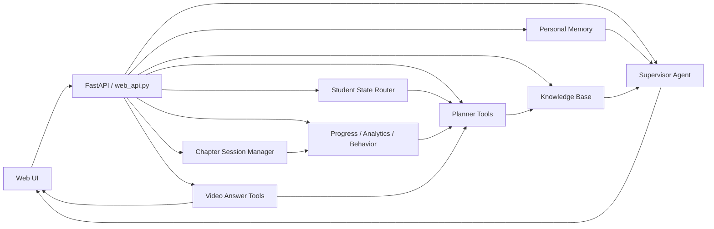

# Astra Agentic Architecture

This document explains how Astra currently behaves as an agentic AI tutoring system: what the system can do on its own, which parts are coordinated by the backend, how state flows between tools, and where each agent or subsystem begins and ends.

The short version:

- Astra is not one single monolithic agent.
- It is a coordinated system of a central supervisor agent plus specialized tools and state managers.
- The UI is the presentation layer.
- The backend routes, prompt builders, memory stores, planner logic, checkpoint logic, and knowledge retrieval together form the actual agentic loop.

---

## 1. What “agentic” means in Astra

In Astra, “agentic” means the system can:

- observe the student’s current state,
- choose a response strategy,
- retrieve the right context,
- generate or adapt a plan,
- take an action that changes the student’s learning state,
- and use that outcome to shape the next interaction.

That is already happening across several flows:

- tutor replies adapt to the student’s profile, memory, topic, and current state
- weekly plans and daily focus are generated from the student’s journey
- chapter sessions advance subtopic by subtopic and trigger checkpoints
- checkpoint scores update progress, mastery, memory, and next steps
- video explanations are pre-generated from the weekly plan
- progress insights and daily briefings are generated from live learning state

So Astra’s agentic behavior is not just “chatting well”. It is the full loop of:

**state -> decision -> action -> memory/progress update -> next decision**

---

## 2. The core agentic capabilities currently in the app

### 2.1 Adaptive tutoring

Astra can adjust its teaching based on:

- the student’s topic and subject
- the current session type
- checkpoint performance
- personal memory
- behavior and engagement history
- planner state
- chapter session state
- knowledge base retrieval

This means the tutor does not just answer. It teaches differently depending on the student’s learning context.

### 2.2 Plan generation and session orchestration

Astra can generate:

- complete JEE journey plans
- weekly plans
- today’s focus
- revision due lists
- chapter sessions
- chapter tests
- next action recommendations
- daily briefings
- progress insights

These are all generated from shared student state rather than from isolated prompts.

### 2.3 Knowledge-grounded answering

Astra can retrieve context from:

- NCERT-style concept material
- JEE PYQs
- uploaded local sources
- web-ingested sources

The tutor prompt builder can then combine this material with the student’s state before answering.

### 2.4 Memory-aware tutoring

Astra stores and reuses personal memory such as:

- student interests
- life context
- emotional check-ins
- meaningful prior notes

That memory becomes part of the tutor prompt and helps Astra sound consistent over time.

### 2.5 Chapter mastery flow

Astra can run a chapter as a structured learning journey:

- start a chapter session
- teach subtopic 1
- checkpoint
- teach subtopic 2
- checkpoint
- continue until the chapter ends
- generate and submit chapter test
- record mastery and revision needs

This is the clearest “agentic learning loop” in the app.

### 2.6 Video explanation planning

Astra can pre-generate video briefs from the weekly plan so video learning is no longer disconnected from the study journey.

---

## 3. The major agentic subsystems

### 3.1 Supervisor agent

**Location:** `agents/supervisor_agent.py`

The supervisor agent is currently a thin alias:

- `supervisor_agent = agentic_learning_orchestrator`

This means the central orchestration entrypoint is the `agentic_learning_orchestrator` from the agent framework.

#### Scope

The supervisor is the top-level coordination layer for agentic responses.

#### Boundary

It does not own every domain rule itself. It relies on:

- prompt builders
- student state routing
- memory context
- knowledge base context
- planner state
- chapter/session state

---

### 3.2 Tutor prompting system

**Location:** `tools/prompt_instruction_tools.py`

This module is one of the most important pieces of the system.

It builds the instruction block and the specialized prompts for:

- normal tutor replies
- subtopic explanations
- checkpoint questions
- chapter tests
- checkpoint evaluation

#### Important functions

- `build_tutor_prompt(...)`
- `build_subtopic_explanation_prompt(...)`
- `build_subtopic_checkpoint_prompt(...)`
- `build_chapter_test_prompt(...)`
- `generate_checkpoint_question(...)`
- `evaluate_checkpoint_answer(...)`

#### Scope

This layer defines:

- how Astra should speak
- what learning context it should consider
- what sources it should pull in
- what the student should experience next

#### Boundary

It shapes the prompt, but it should not be treated as the system of record for progress or planning. That belongs elsewhere.

---

### 3.3 Student state router

**Location:** `tools/student_state_router.py`

This is the decision engine that determines how Astra should behave at a high level.

It uses signals such as:

- conversation mode
- student insight snapshot
- today’s focus
- revision due
- mastery map
- support style
- current progress

It produces a routed state with labels such as:

- `on_track_learning`
- `behind_schedule`
- `revision_overdue`
- `ready_for_practice`

#### Scope

This module is the “behavior policy” layer.

It helps decide:

- tone
- pressure level
- source policy
- teaching feel
- what kind of explanation Astra should give next

#### Boundary

It does not generate the final educational content. It guides how the content should be delivered.

---

### 3.4 Planner system

**Location:** `tools/planner_tools.py`

The planner system is the scheduling and journey engine.

It is responsible for:

- generating the journey plan
- generating the weekly plan
- returning today’s focus
- calculating revision due topics
- recording topic outcomes
- balancing the plan when progress changes

#### Scope

This is the system’s source of truth for:

- what the student should do today
- what they should study this week
- what needs revision
- how the study journey should evolve

#### Boundary

It owns schedule and plan logic, not tutoring language.

---

### 3.5 Chapter session manager

**Location:** `tools/chapter_session_tools.py`

This module turns a chapter into an interactive subtopic-by-subtopic journey.

It manages:

- starting a chapter session
- finding the current subtopic
- completing a subtopic
- recording chapter test results
- summarizing chapter performance
- resetting chapter progress
- listing all chapter summaries

#### Scope

This is the chapter-level state machine.

#### Boundary

It does not decide how Astra explains. It only decides where the student is in the chapter flow.

---

### 3.6 Knowledge base and retrieval

**Location:** `tools/knowledge_base_tools.py`

The KB layer provides retrieved learning material from:

- concept sources
- NCERT-style sources
- PYQs
- uploaded documents
- web sources

#### Scope

It answers questions like:

- what source material is relevant here?
- are there PYQs on this topic?
- what should be given to the tutor prompt?

#### Boundary

The KB does not produce the final explanation by itself. It supplies source context to the prompt builder and tutor flows.

---

### 3.7 Personal memory

**Location:** `tools/personal_memory_tools.py`

This layer stores and reuses personal information that helps Astra sound human and consistent.

Examples:

- known people
- interests
- life notes
- emotional check-ins

It also provides:

- `format_personal_memory_context(name)`
- `build_tutor_brief_memory_context(name)`

#### Scope

This is the student relationship memory.

#### Boundary

It is not the planner and not the progress tracker. It only stores and serves personal context.

---

### 3.8 Progress, analytics, and behavior layers

These are the “what happened?” layers.

They help Astra remember outcomes and adapt over time.

#### Progress tracking

Records:

- checkpoint attempts
- subtopic scores
- chapter scores
- completion state

#### Analytics

Tracks:

- score trends
- time spent
- engagement signals
- chapter mastery summaries

#### Behavior tracking

Tracks:

- events
- study patterns
- response behavior
- session activity

#### Boundary

These layers are not the tutor voice. They are the evidence trail that informs future tutoring and planning.

---

### 3.9 Video brief and video generation layer

**Location:** `tools/video_answer_tools.py`

This system:

- creates video briefs
- pre-generates briefs from weekly plans
- loads video status for a topic
- stores requested videos
- coordinates the handoff into the existing video pipeline

#### Scope

This is the visual explanation preparation layer.

#### Boundary

It should not alter the core tutor flow. It augments it with pre-planned video support.

---

## 4. How the agents are connected

The app is best understood as a set of connected loops rather than isolated agents.

### Shared state that connects everything

The main shared state objects are:

- student profile
- planner journey / weekly / today files
- chapter session file
- progress files
- personal memory
- knowledge base
- UI cache for daily briefing / insight
- tutor conversation state

These stores are what allow one subsystem to inform the others.

### Flow of influence

- **Planner** decides what should be studied.
- **State router** decides how Astra should behave.
- **KB** supplies content for the topic.
- **Memory** supplies personal context.
- **Tutor prompt builder** merges these into the final teaching prompt.
- **Tutor UI** renders the result.
- **Checkpoints** measure understanding.
- **Progress / analytics / behavior** record the outcome.
- **Planner** updates future sessions from the outcome.

This is the closed loop.

---

## 5. Main orchestration workflows

## 5.1 Tutor reply workflow

When the student asks Astra a question:

1. The frontend sends the request to the tutor endpoint.
2. The backend loads:
   - student profile
   - current planner state
   - current focus
   - student state route
   - personal memory context
3. The tutor prompt builder queries the knowledge base.
4. The prompt is assembled with:
   - instructional rules
   - student context
   - memory
   - KB sources
   - session type
5. The supervisor agent / orchestration layer produces the answer.
6. The response is saved to conversation history.
7. The frontend may update:
   - current topic
   - status bar
   - video suggestions
   - checkpoint suggestions

### What makes this agentic

The answer is not just generated from a fixed prompt. It depends on current state, sources, memory, and learning route.

---

## 5.2 Weekly plan workflow

When the weekly plan is created or refreshed:

1. The journey plan is generated from the exam date and available hours.
2. The weekly plan is derived from the journey.
3. Video briefs are pre-generated for the planned topics.
4. The student’s today view is updated.
5. The UI shows what is coming next.

### What makes this agentic

The plan adapts to the student, and later actions are pre-scripted from that plan.

---

## 5.3 Chapter learning workflow

This is one of the strongest agentic loops in Astra.

1. The student starts a chapter session.
2. The current subtopic is determined.
3. Astra teaches the subtopic.
4. A checkpoint is shown.
5. The answer is evaluated.
6. The subtopic is marked complete.
7. The chapter session advances to the next subtopic.
8. After all subtopics, the chapter test is triggered.
9. The chapter test score is recorded.
10. Mastery and revision needs are updated.
11. The planner and state router are refreshed.

### What makes this agentic

Astra is not just tutoring. It is moving the learner through a structured chapter machine that changes state after each success or failure.

---

## 5.4 Checkpoint workflow

For each checkpoint:

1. The tutor prompt builder generates the question.
2. The frontend renders the checkpoint card.
3. The student answers.
4. The answer is evaluated.
5. The result is written into progress / analytics.
6. The tutor UI shows feedback.
7. The next state is updated.

### What makes this agentic

The system is not passive. It measures understanding and reacts.

---

## 5.5 Progress insight workflow

When the Progress tab opens:

1. Astra loads the chapter mastery board.
2. It generates or loads a personalized insight.
3. It shows the student what is strong and what needs attention.

This is more than reporting. It is a recommendation system based on actual chapter performance.

---

## 5.6 Daily briefing and next-action workflow

When the student opens Home:

1. The app requests a daily briefing.
2. Astra summarizes what should happen today.
3. After a session completes, Astra can recommend the next action.

This is a lightweight agentic guidance layer.

---

## 5.7 Video workflow

For video explanations:

1. The weekly plan identifies upcoming topics.
2. Video briefs are pre-generated.
3. The student can request a topic manually.
4. The system returns the relevant brief or generates one.
5. The video pipeline can then render the explanation.

### What makes this agentic

Video content is not isolated. It is planned from the learning journey and can be triggered by current topic awareness.

---

## 6. Agent boundaries and scope

This is the most important part for understanding the architecture correctly.

### 6.1 Supervisor agent boundary

The supervisor agent is the top orchestration entrypoint, but it does not own all learning state.

It depends on:

- planner tools
- student state routing
- prompt builders
- KB retrieval
- memory

### 6.2 Tutor prompt builder boundary

The prompt builder can assemble context and instructions, but it should not be treated as the source of truth for schedule or mastery.

### 6.3 Planner boundary

The planner owns the journey schedule.

It should not be used as a general memory store or content generator.

### 6.4 State router boundary

The state router decides behavior policy.

It should not be used to calculate the official timetable.

### 6.5 Knowledge base boundary

The KB is for retrieval only.

It should not be treated as the final answer engine.

### 6.6 Memory boundary

Memory stores student context.

It should not replace planner state or progress state.

### 6.7 Progress / analytics boundary

These layers record evidence and trends.

They should not be the source of the actual lesson plan.

### 6.8 UI boundary

The frontend is a coordinator and renderer.

It should not own authoritative learning state.

---

## 7. What Astra can do agentically today

Today Astra can:

- build a learning journey
- produce a weekly schedule
- identify today’s focus
- adapt tutor tone and policy from student state
- retrieve relevant learning context
- teach with memory-aware continuity
- generate checkpoints
- evaluate checkpoint answers
- update progress and mastery
- trigger chapter tests
- recommend next actions
- generate daily briefings
- create video briefs from the weekly plan
- keep a conversation and session flow across tabs

That is a real adaptive learning loop.

---

## 8. What Astra is not doing yet

To stay precise, these are not fully autonomous:

- it does not independently reason across all products without tool support
- it does not have separate self-managed long-running agent swarms in the app UI
- it does not currently operate as a fully autonomous task graph without backend routes and state tools
- it does not automatically infer every possible educational outcome without explicit retrieval / prompt / state inputs

So the current architecture is:

**central orchestration + specialized tools + shared state + adaptive UI**

not a free-running autonomous agent system.

---

## 9. High-level architecture diagram

---

## 10. Practical reading order for the codebase

If you want to study the architecture in the source code, read it in this order:

1. `web_api.py`
2. `tools/student_state_router.py`
3. `tools/planner_tools.py`
4. `tools/prompt_instruction_tools.py`
5. `tools/knowledge_base_tools.py`
6. `tools/personal_memory_tools.py`
7. `tools/chapter_session_tools.py`
8. `tools/video_answer_tools.py`
9. `web/app.js`

That order shows the flow from orchestration to decision-making to teaching to UI.

---

## 11. Summary

Astra’s current agentic design is a coordinated learning loop:

- **Planner** decides what should happen.
- **State router** decides how Astra should act.
- **Knowledge base** provides grounding.
- **Memory** keeps Astra personal and consistent.
- **Supervisor agent** orchestrates the reply behavior.
- **Chapter session manager** drives subtopic mastery.
- **Progress and analytics** record outcomes.
- **Video tools** pre-plan media support.
- **UI** reflects the live state and gives the student control.

That is the core of Astra’s current agentic architecture.

